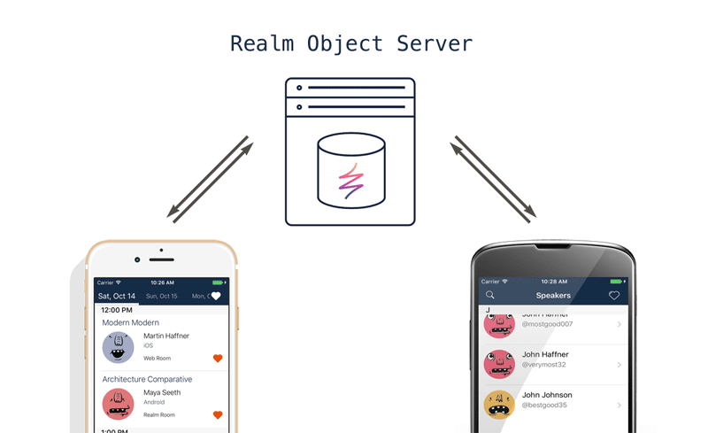

# EventBlank

A template conference app, featuring real-time schedule and data changes &amp; running on Realm 🚀

The goal of this project is to enable event and conference organizers to quickly and easily build their mobile presence with the help of this project by Realm. This is in no way a service you use; it is an open source project you can build and deploy yourself.

This free open-source project features several sub-projects for different platforms. All the apps you get connect to the same server and use the same data. Once you set up a local or remote server to work with do try building some of the client apps:

[1) Setting up a Realm Object Server to use with EventBlank](server/README.md)

[2) EventBlank for iOS](iOS/README.md) (Swift 3.1)

[3) EventBlank for Android](android/README.md) (Kotlin)

[4) EventBlank website](web/README.md) (Node.js or static HTML)

## Credits

### License

[MIT licensed.](LICENSE)

### About

The names and logos for Realm are trademarks of Realm Inc.

We :heart: open source software!

See [our other open source projects](https://realm.github.io), check out [the Realm Academy](https://academy.realm.io), or say hi on twitter ([@realm](https://twitter.com/realm)).
