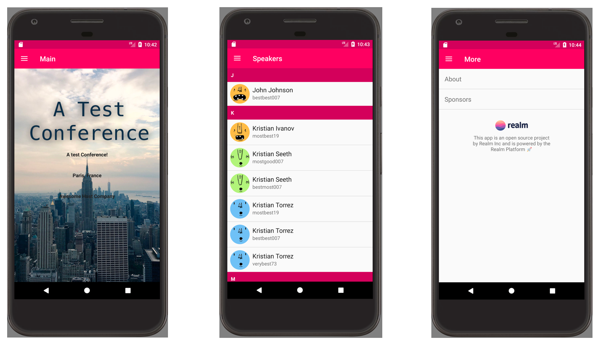
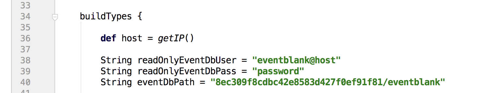

# EventBlank for Android

This is the iOS app of the EventBlank project. For an overview of the whole project head to the [main readme](../README.md).

## Installation

**Requirements:** Android Studio 3.0 Beta 6, Terminal, Realm Platform 1.8.x

**Notes:** 
*  This project uses Kotlin and Android Architecture Components which at the time of writing this, requires Android Studio 3.0 Beta X versions.  When you clone this repository, it's likely the versions have been updated and you may have to upgrade the Kotlin version or Archtecture Components version.  This may result in the need to update the code if API's have changed.  Once Google & Jetbrains stablize these features.  They will be updated to the final versions.

*  The Android version of EventBlank is currently missing a few of the features that the iOS version has.  Specifically it does not support.
   *  Favorites (for speakers or sessions)
   *  Search for speakers
   *  Theming from the RP Eventblank Database.  (Theming is supported via the standard Android styles.xml mechanism).
   *  The "more" pages do not support Markdown.  (But they do support HTML)

### Set up the server

Before running a client app you need to setup the server. [More info here](../server/README.md).

### Setting up the Android project

In the **app/build.gradle** file of this project update the placeholder values for the username, password, and database path with your own. Here's an example:

For a locally running server keep the host value the same. Change username and password to the credentials of the user with read-only access (as created during the server setup).

Finally edit the `path` value by replacing the unique id in the example with the ID of the read-write user you created. You can find the ID in the server console:

## Limitations

Event Blank is designed to be an example of the power of the Realm Platform to build a cross platform Conference application with real time capabilities.  It is hoped that this could be a great starting point for developers building a conference application or for those who just want to learn more about Realm. 

Issues and limitations are described in the GitHub Issues page for this repo.

## License

Distributed under the Apache 2.0 license. See [LICENSE](../LICENSE) for more information.

## About

The names and logos for Realm are trademarks of Realm Inc.

We :heart: open source software!

See [our other open source projects](https://realm.github.io), check out [the Realm Academy](https://academy.realm.io), or say hi on twitter ([@realm](https://twitter.com/realm)).
