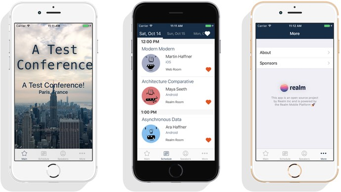
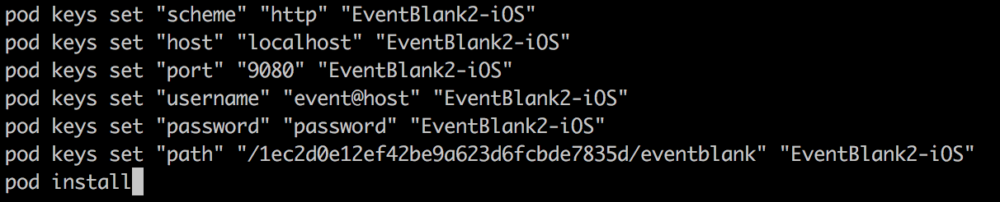
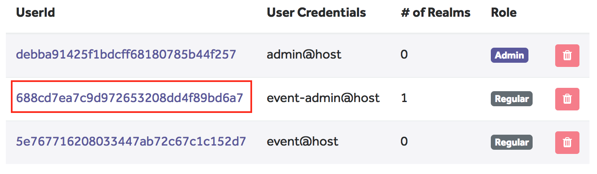

# EventBlank for iOS

This is the iOS app of the EventBlank project. For an overview of the whole project head to the [main readme](../README.md).



## Installation

**Requirements:** Xcode 8.3.2, Swift 3.1, CocoaPods, Terminal

### Set up the server

Before running a client app you need to setup the server. [More info here](../server/README.md).

### Setting up the iOS project

In the **iOS** folder of this project copy the file `example-set-keys.sh` to `keys-local.sh` and edit the new file setting the placeholder values with your own. Here's an example:



For a locally running server keep the scheme, host and port values the same. Change username and password to the credentials of the user with read-only access (as created during the server setup).

Finally edit the `path` value by replacing the unique id in the example with the ID of the read-write user you created. You can find the ID in the server console:



Once you finish editing `keys-local.sh` open the a terminal and make the file executable (line 1) and run it (line 2):

```
chmod +x keys-local.sh
./keys-local.sh
```

This will configure the connection data to your server and install all iOS project dependencies.

### Running EventBlank for iOS

At that point you can open **EventBlank2-iOS.xcworkspace** in Xcode, build and run the app. If you followed the instructions correctly and created test data on the server you will see that data show up in your app.

Extra steps before publishing your app:

* change the app title, bundle identifier, and team
* add your app icons to the project assets catalogue

## Credits

### License

[MIT licensed.](LICENSE)

### About


The names and logos for Realm are trademarks of Realm Inc.

We :heart: open source software!

See [our other open source projects](https://realm.github.io), check out [the Realm Academy](https://academy.realm.io), or say hi on twitter ([@realm](https://twitter.com/realm)).
