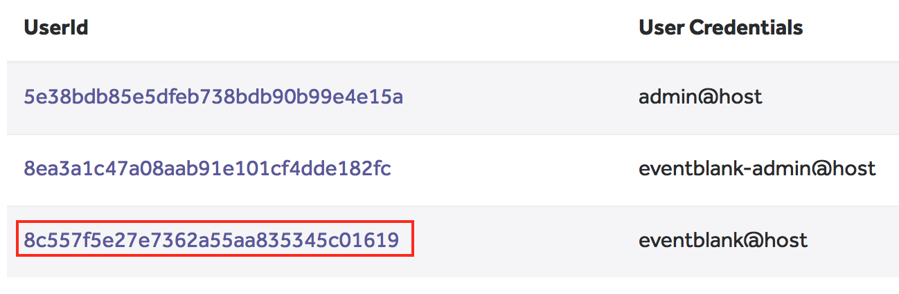

# Setting up EventBlank on the server

> This is the iOS app of the EventBlank project. For an overview of the whole project head to the [main readme](../README.md).

## Setting up a Realm Object Server

All EventBlank client apps (iPhone, Android, web, etc.) connect to a Realm Object Server instance, that you run on your server, in order to provide real-time updates to the app users.


You can run the server locally on your mac during development or in a Linux virtual box and install the server [Developer Edition from here for free](https://realm.io/products/realm-mobile-platform). (You can also run the free version in production for your event.)

**Requirements**: Terminal and Node.js.

**Steps to set up the server**:

**1)** Download the Developer Edition, navigate to your downloads folder and open the “realm-mobile-platform” folder.

Start Realm Object Server by double-clicking the file `start-object-server.command`. This file will open a terminal window and start Realm Object Server for you.

Starting the server will automatically open the Realm Dashboard (if it does not, please go to http://localhost:9080). The first time you open the console you will be asked to create an admin user.

**2)** Create two users with email addresses:

* `eventblank-admin@host`
* `eventblank@host`

**3)** Make sure you have [Node.js](https://nodejs.org) installed and open a Terminal within the `server` folder of this project.

Run `npm install` to install the app's dependencies.

Create some test data in the event file via the command below. Set `delete` to `yes` in case there is existing EventBlank data you want to purge. The `amount` parameter sets how much data the script should create:

```none
node test-data.js 
  --host [YOUR_HOST] --port [YOUR_PORT] 
  --username eventblank-admin@host --password [PASSWORD] 
  --delete [yes|no]
  --amount [minimal|plenty]
```

**4)** Find the user id of your read-only user to use with the next command. You can see the user id in the web server console:



Then execute the following command to setup the user rights on the server:

```none
node users-app.js 
  --host [YOUR_HOST] --port [YOUR_PORT] 
  --username eventblank-admin@host --password [PASSWORD] 
  --command readonly --to [READONLY_USER_ID]
```

Now the server and the users are all set. 

As the next step you can setup and run one of the client apps. More info in the [main readme](../README.md).

## Credits

### License

Distributed under the Apache 2.0 license. See [LICENSE](../LICENSE) for more information.

### About


The names and logos for Realm are trademarks of Realm Inc.

We :heart: open source software!

See [our other open source projects](https://realm.github.io), check out [the Realm Academy](https://academy.realm.io), or say hi on twitter ([@realm](https://twitter.com/realm)).
